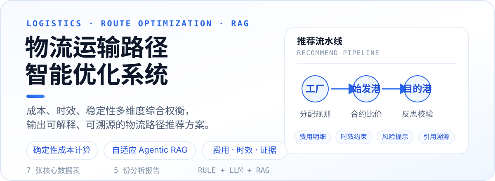
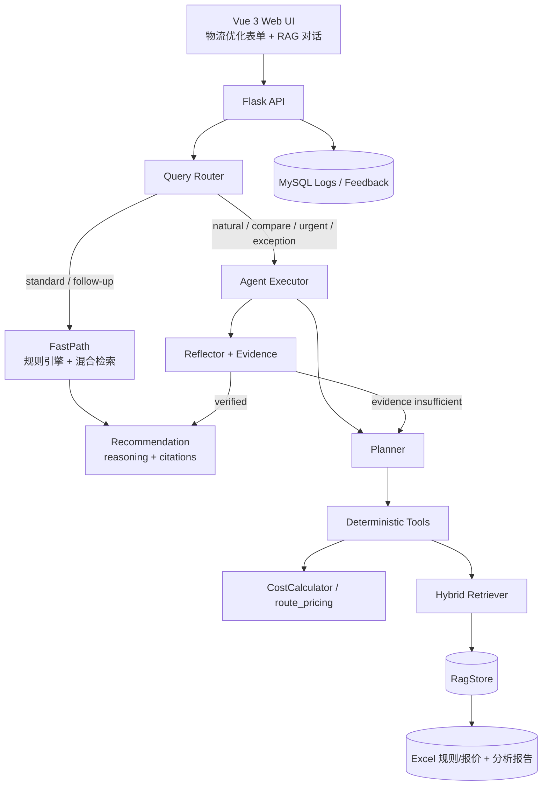

<p align="center">
  
</p>

<div align="center">


</div>

> 把“算出一条路径”升级为“问得清、查得到、算得准、学得会”的物流路径优化系统。

## 这是什么

面向外销物流运输场景的路径推荐系统，基于历史运输数据与规则表，从**成本、时效、稳定性**三个维度综合评估候选路线，输出工厂、始发港、目的港、贸易条款、箱型、费用明细与推荐理由。

系统保留确定性规则引擎作为底线，并叠加**自适应 Agentic RAG**：简单请求走快速路径，复杂对比、加急、异常排查等多步问题由 Agent 调用确定性工具完成，最终结果带检索引用与证据状态。

| 能力 | 实现方式 | 用户价值 |
| --- | --- | --- |
| 确定性成本计算 | `CostCalculator` + `route_pricing` | 费用可复算，不依赖 LLM 编数字 |
| 规则引擎兜底 | 工厂分配规则 + 候选枚举 | 无 API Key 时仍可完整推荐 |
| 自适应路由 | `agent/router.py` | 简单问题少检索，复杂问题多轮推理 |
| 混合检索 | 结构化 + BM25 + 向量/哈希回退 | 兼顾权威数据、关键词与语义召回 |
| 证据与反思 | `Reflector` + `EvidenceScorer` | 低置信结果标记 `needs_review` |
| 反馈闭环 | MySQL 日志 + 调权接口 | 确认、改选、费用修正可回流 |

## 系统工作流



## 快速开始

### 1. 环境准备

- 推荐 `Python 3.12`
- 前端为 Vue 3 本地 ES Modules，无需 Node.js 构建
- MySQL 与 LLM 均为可选依赖

### 2. 安装依赖

```powershell
cd D:\11111\Path-optimization-rag
python -m venv .venv
.\.venv\Scripts\Activate.ps1
pip install -r requirements.txt
```

> 如果 PowerShell 中 `python` 不可用，可使用 `py -3.12` 代替。

### 3. 启动服务

```powershell
python back\app.py
```

服务默认监听 `http://localhost:5000`。

### 4. 访问页面

| 地址 | 页面 |
| --- | --- |
| `http://localhost:5000/` | 登录页 |
| `http://localhost:5000/app` | 物流路径优化主应用 |
| `http://localhost:5000/rag` | RAG 智能问答助手 |
| `http://localhost:5000/api/logistics/health` | 健康检查 |

未配置 MySQL 时，后端登录会回退到开发账号 `admin / admin123`；生产环境请务必启用数据库并修改密码。

## 配置

### LLM（可选）

系统不配置 LLM 时仍可用规则引擎完成推荐。启用 LLM 后可增强自然语言理解、路由分类与解释生成。

```powershell
$env:LLM_API_KEY = "your-api-key-here"
$env:LLM_API_URL = "https://api.deepseek.com/v1/chat/completions"
$env:LLM_MODEL = "deepseek-chat"
```

也可在项目根目录的 `.env` 中配置：

```dotenv
LLM_API_KEY=your-api-key-here
LLM_API_URL=https://api.deepseek.com/v1/chat/completions
LLM_MODEL=deepseek-chat
```

### 自适应 Agentic RAG

默认开启，且默认使用轻量哈希向量回退，不需要额外重依赖。

```dotenv
RAG_ENABLED=true
AGENT_ENABLED=true
RAG_EMBEDDING_ENABLED=false
EMBEDDING_MODEL=BAAI/bge-small-zh-v1.5
RETRIEVAL_TOP_K=8
RETRIEVAL_MAX_K=16
```

如需启用语义向量检索，安装可选依赖并将 `RAG_EMBEDDING_ENABLED` 设为 `true`：

```bash
pip install sentence-transformers pydantic
```

### MySQL（可选）

未配置时推荐功能可运行，但登录、推荐日志与反馈学习不持久化。

```dotenv
DB_ENABLED=true
DB_HOST=127.0.0.1
DB_PORT=3306
DB_USER=root
DB_PASSWORD=your-password
DB_NAME=logistics_optimizer
```

首次启动会自动创建：

- `logistics_recommendation_log`：推荐输入、输出与费用确认
- `logistics_users`：注册与登录用户
- `recommendation_feedback`：确认、改选、费用修正反馈

## API 接口

<details>
<summary><b>展开完整 API 列表</b></summary>

| 模块 | 方法 | 路径 | 说明 |
| --- | --- | --- | --- |
| 页面 | GET | `/` | 登录页 |
| 页面 | GET | `/app` | 物流优化主应用 |
| 页面 | GET | `/rag` | RAG 智能问答页 |
| 核心推荐 | POST | `/api/logistics/recommend` | 获取物流路径推荐方案 |
| 对话推荐 | POST | `/api/chat` | 自适应 Agentic RAG 对话入口 |
| 基础数据 | GET | `/api/logistics/health` | 健康检查 |
| 基础数据 | GET | `/api/logistics/knowledge` | 知识库摘要 |
| 基础数据 | GET | `/api/logistics/factories` | 工厂列表与产能信息 |
| 基础数据 | GET | `/api/logistics/countries` | 支持运抵国列表 |
| 基础数据 | GET | `/api/logistics/country-info` | 指定运抵国详情 |
| 航线 | GET | `/api/route-info` | 产品、运抵国到最优航线 |
| 海运费 | GET | `/api/freight-rate` | 单条合约海运费查询 |
| 海运费 | POST | `/api/freight-rate-batch` | 批量合约海运费查询 |
| 海运费 | POST | `/api/freight-rate-compare` | 船公司多箱型比价 |
| 陆运 | GET | `/api/land-freight` | 陆运费推荐 |
| 港杂 | GET | `/api/port-misc-fee` | 港杂费推荐 |
| 费用估算 | POST | `/api/estimate-toll` | 高速通行费估算 |
| 港口数据 | GET | `/api/countries-source` | 从运抵国表获取国家列表 |
| 港口数据 | GET | `/api/dest-ports` | 按运抵国获取终到港 |
| RAG | GET | `/api/kb/search` | 知识库混合检索 |
| RAG | GET | `/api/kb/stats` | 检索库统计信息 |
| RAG | POST | `/api/kb/rebuild` | 强制重建检索索引 |
| 认证 | POST | `/api/login` | 用户登录 |
| 认证 | POST | `/api/register` | 用户注册 |
| 反馈 | POST | `/api/recommendation/feedback` | 记录用户反馈 |
| 反馈 | GET | `/api/recommendation/feedback-weights` | 查看当前反馈调权 |
| 反馈 | POST | `/api/recommendation/confirm` | 回写前端确认后的总费用 |

</details>

## 推荐接口示例

### 请求

```json
// POST /api/logistics/recommend
{
  "customer": "Medline Inc.",
  "productType": "丁腈手套",
  "destCountry": "美国",
  "boxCount": 800,
  "weight": 12000,
  "volume": 68,
  "cargoReady": "2026-08-15",
  "shipSchedule": "2026-08-20",
  "transportPref": "balanced",
  "tradePref": "auto"
}
```

### 响应结构

```json
{
  "success": true,
  "data": {
    "primary": {
      "factory": "安徽英科医疗用品有限公司",
      "originPort": "上海/SHANGHAI",
      "destPort": "LOS ANGELES",
      "tradeTerm": "CIF",
      "totalCost": 48213.4,
      "totalTransitDays": 32,
      "score": 91.8
    },
    "alternatives": [],
    "reasoning": "在满足船期约束的候选路线中，综合费用、时效与稳定性得分最高。",
    "riskWarning": "",
    "engine": "adaptive_agentic_rag",
    "citations": [],
    "retrievalUsed": true,
    "generatedAt": "2026-08-15T00:00:00"
  }
}
```

> 响应示例为结构示意，实际数值取决于当前数据表与配置。对话入口 `POST /api/chat` 使用 `message`、`sessionId`、`form` 字段。

## 项目结构

```text
Path-optimization-rag/
├── back/                         # Flask 后端
│   ├── app.py                    # API 路由、静态页面托管
│   ├── config.py                 # 路径、LLM、MySQL、RAG/Agent 配置
│   ├── data_loader.py            # Excel 数据加载
│   ├── knowledge_base.py         # 工厂、港口、条款、时效知识
│   ├── cost_calculator.py        # 全费用计算
│   ├── llm_client.py             # LLM 客户端 + 规则引擎候选
│   ├── route_pricing.py          # 陆运、港杂、合约报价
│   ├── recommendation_engine.py  # 推荐总入口
│   ├── retriever.py              # 混合检索编排
│   ├── rag_store.py              # 分块、索引、RAG 存储
│   ├── session_store.py          # 会话上下文
│   ├── feedback_weights.py       # 反馈调权
│   ├── db.py                     # MySQL 用户、日志、反馈
│   ├── agent/                    # Agentic RAG 组件
│   │   ├── router.py
│   │   ├── planner.py
│   │   ├── executor.py
│   │   ├── extractor.py
│   │   ├── reflector.py
│   │   ├── evidence.py
│   │   └── tools.py
│   └── scripts/                  # RAG 评测与调权脚本
├── front/                        # Vue 3 前端（ES Modules，无构建）
│   ├── index.html                # 登录页
│   ├── register.html             # 注册页
│   ├── logistics-optimizer.html  # 物流优化主应用
│   ├── rag.html                  # RAG 智能问答
│   ├── all-routes.html           # 全路线页
│   └── assets/
│       ├── css/                  # 按页面与模块拆分样式
│       ├── js/                   # API、状态、表单、结果、RAG 组件
│       └── vendor/               # Vue 3 本地 ESM
├── data/                         # 核心数据表、反馈缓存、分析报告
│   ├── 工厂分配区间规则.xlsx
│   ├── 海运费参考标准.xlsx
│   ├── 港杂费标准_贸易条款承运商箱型港口.xlsx
│   ├── 工厂到起运港拖车费_运输方式承运商发货工厂始发港.xlsx
│   ├── 工厂到起运港时效分析表.xlsx
│   ├── 运抵国与目的港.xlsx
│   ├── 集装箱标准容积对照表.xlsx
│   ├── feedback_weights.json
│   └── report/                   # 5 份 docx 报告 + 图表目录
├── docs/                         # RAG 改造方案、评测报告、PPT 材料
├── materials/                    # 原始业务明细，供后续 ETL/溯源加工
└── requirements.txt
```

## 验证与评测

系统提供严格口径 RAG 评测脚本，覆盖纯检索召回、`≥2词` 上下文精度、句子级忠实度与答案相关性。

```powershell
py back\scripts\eval_rag.py --llm
```

评测报告位于 `docs/rag-eval-report.md`。当前基线为 9 道测试题、`7444` 个检索 chunk；具体指标以报告为准，避免将实验评测当作生产 SLA。

## 文档

- `docs/为什么需要自适应AgenticRAG.md`：课题背景与架构选择论证
- `docs/adaptive-agentic-rag.md`：自适应 Agentic RAG 改造方案
- `docs/rag-eval-report.md`：严格口径评测结果与问题修复记录
- `docs/ppt-adaptive-agentic-rag.md`：汇报 PPT 文案
- `data/report/`：物流路径分析、成本模型、港口对比、优化方案等报告

## 边界与限制

- `materials/` 原始业务明细当前未自动入 RAG 索引，主要用于后续 ETL 与数据溯源。
- 未安装 `sentence-transformers` 时，向量检索使用字符 n-gram 哈希回退。
- 未配置 MySQL 时的 `admin / admin123` 仅用于本地开发，不应暴露到生产环境。
- 当前端口默认 `5000`，可通过 `HOST`、`PORT` 环境变量覆盖。
