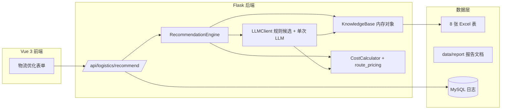
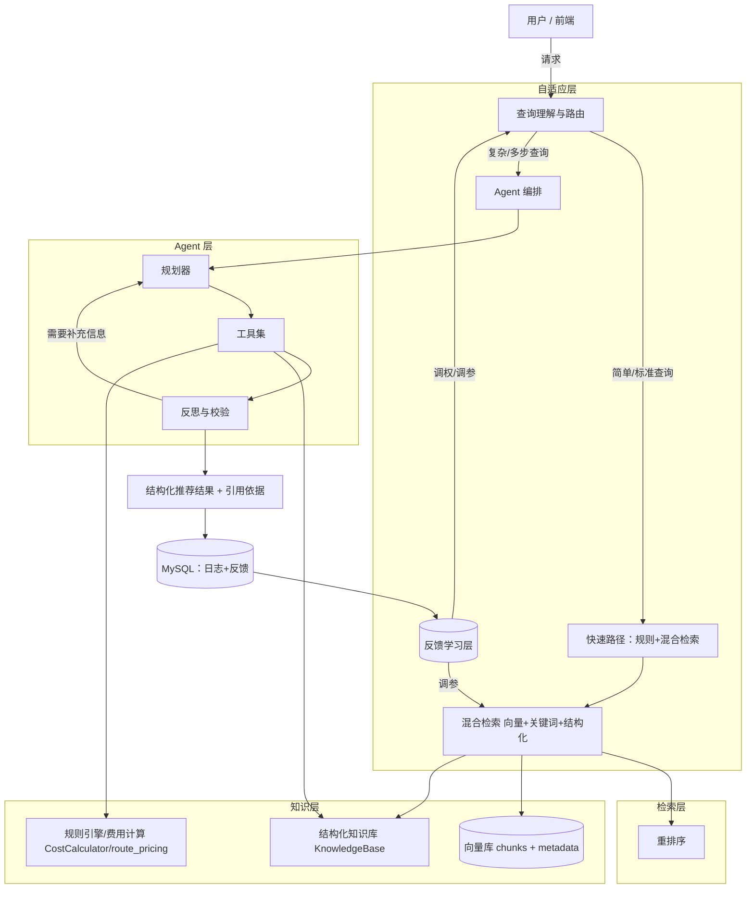
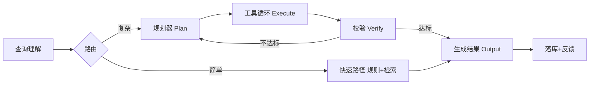

# 物流路径优化系统 -> 自适应 Agentic RAG 改造方案

> 版本：v1.0
> 适用代码库：Path-optimization（Flask + Vue 3 物流路径智能优化系统）
> 目标读者：后端开发、算法工程师、产品负责人
> 前置阅读：`docs/为什么需要自适应AgenticRAG.md`（论证本课题为什么需要这套架构）

---

## 1. 背景与目标

### 1.1 一句话目标

把当前"规则引擎生成候选 + 单次 LLM 挑最优"的静态推荐架构，升级为"查询理解 -> 自适应检索 -> 多步 Agent 规划与工具调用 -> 反思校验 -> 反馈学习"的自适应 Agentic RAG 架构。

### 1.2 为什么需要改造

当前系统已经做得不错、改造时应保留的部分：

- 8 张 Excel 数据表 + `data/report` 分析报告（5 份 docx + 图表目录 html）已被加载为可检索知识库，工厂/港口/贸易条款/箱型/船公司/分析结论信息齐全；
- `CostCalculator` + `route_pricing` 提供确定性费用计算，结果可复现、可解释；
- `LLMClient` 已有"规则引擎先行、LLM 只做选择、质检回退"的雏形（`llm_client.py` 的 `_call_llm` 与 `_build_prompt`）。

与目标能力的差距：

| 能力维度 | 现状 | 问题 |
|---|---|---|
| 知识使用方式 | 启动时全量加载到内存，prompt 一次性塞入 | 无检索、无相关性排序、prompt 随知识膨胀失效 |
| 查询理解 | 无 | 用户复杂问题（对比、异常单、多目的地）无法被理解 |
| 推理能力 | 单次调用 | 不能"先查后算再验证"的多步推理 |
| 工具使用 | LLM 只读 prompt 里的候选 | LLM 不能主动查询合约、时效、历史记录 |
| 自校正 | 仅"选贵方案回退"一条硬编码规则 | 无结构化校验、无缺失数据补检、无反思 |
| 学习闭环 | 有 MySQL 日志与确认接口 | 反馈数据未回流到排序/评分 |
| 可解释性 | 有 reasoning 文本 | 无检索依据（citations），无法溯源 |
| 对话能力 | 单轮表单 | 不能连续追问、澄清需求 |

### 1.3 改造原则

1. 保留确定性内核：费用计算、时效计算、合约报价仍是"硬工具"，Agent 只能调用它们，不能凭空捏造。
2. RAG 负责补知识：把规则表、报价表、历史统计变成可检索的知识，Agent 按需取用。
3. Adaptive 负责降本增效：简单查询走快速路径，复杂查询才启动多步 Agent，控制延迟与成本。
4. 兼容现有 API：`POST /api/logistics/recommend` 保持可用，Agent 化作为增强层叠加，不推倒重来。

---

## 2. 现状架构回顾



关键代码路径：

- `back/recommendation_engine.py` -> `RecommendationEngine.recommend()`：统一入口
- `back/llm_client.py`：
  - `_generate_candidates()`：规则引擎枚举候选路线并计算费用、评分
  - `_build_prompt()`：把"知识库摘要 + 国家统计 + 前 8 条候选"拼成单次 prompt
  - `_call_llm()`：一次调用，LLM 返回 `primary_index` + `reasoning`
  - `_rule_based_recommend()`：LLM 不可用时的规则兜底
  - 质检：LLM 选贵方案时强制回退（`primary_idx = 0`）
- `back/knowledge_base.py`：启动时构建工厂/港口/贸易条款等内存知识
- `back/cost_calculator.py`、`back/route_pricing.py`：确定性费用与时效计算
- `back/db.py`：推荐日志 + 用户确认回写（`safe_update_recommendation_total`）

---

## 3. 目标架构：自适应 Agentic RAG

### 3.1 总体架构图



### 3.2 一次请求的完整链路（复杂查询示例）

用户：美国 12000kg 丁腈手套 800 箱，要赶 8 月底船期，DDP，客户对交期很敏感

1. 查询理解与路由
   - 识别：标准推荐 + 时效敏感 + 贸易条款 DDP + 可能有历史单可参考
   - 决策：走 Agent 路径，检索范围 = 工厂规则 + 合约报价 + DDP 历史单，Top-K = 10
2. 自适应检索
   - 混合检索出：丁腈手套工厂分配规则、相关合约海运费、美国 DDP 历史方案片段
3. Agent 规划（Plan）
   - 步骤1：按《工厂分配区间规则》锁定工厂候选
   - 步骤2：调用合约海运费工具，取最便宜 5 港
   - 步骤3：调用费用计算器算全费用，按 DDP 条款
   - 步骤4：调用时效工具核对能否赶 8 月底船期
4. 工具执行（Execute）
   - 复用现有 `_generate_candidates` / `CostCalculator.calculate` 等，禁止 LLM 编造数字
5. 反思与校验（Reflect）
   - 校验：所选方案是否满足 arrival deadline？DDP 条款是否可用？
   - 若不满足：返回步骤 3，增加"加急/就近港"检索再算一轮
6. 结果生成
   - 结构化 JSON（兼容现有响应格式）+ reasoning + risk_warning + citations
7. 反馈记录
   - 落库；用户后续确认/修改费用 -> 回流到排序权重

### 3.3 "Adaptive"体现在哪里

| 自适应维度 | 说明 | 对应模块 |
|---|---|---|
| 路由自适应 | 简单查询走快速路径，复杂查询走 Agent | 查询路由器 |
| 检索自适应 | 按查询类型动态调整 Top-K、检索源、是否多轮检索 | 检索策略器 |
| 推理自适应 | 结果不达标时自动补检、重算（self-correction） | 反思器 |
| 成本自适应 | 低风险查询用小模型/少轮数，高价值查询用强模型 | 模型路由器 |
| 学习自适应 | 用户确认/修改历史反馈，动态调评分权重与排序 | 反馈学习层 |

---

## 4. 分层详细设计

### 4.1 数据层：Excel -> 结构化知识 + 向量知识库

#### 4.1.1 分块策略

现有 8 张表结构各异，不建议"整表向量化"，而是按可检索单元切分，并为每个 chunk 打 metadata：

| 数据源（现有文件） | Chunk 类型 | 示例 chunk 内容 | Metadata |
|---|---|---|---|
| 工厂分配区间规则.xlsx | 规则类 | PVC 手套，箱数 100-500 千支 -> 首选 山东英科，备选 安徽英科 | type=rule, material=PVC, box_range |
| 海运费参考标准.xlsx | 报价类 | 青岛->洛杉矶 40HQ USD 2400，船公司 MSC，2026-08 生效 | type=quote, origin_port, dest_port, box_type, valid_from/to |
| 港杂费标准_贸易条款承运商箱型港口.xlsx | 费率类 | 上海 港杂费 40HQ 报关+文件 CNY 1200 | type=fee, port, term, box_type |
| 工厂到起运港拖车费_...xlsx | 运费类 | 山东英科->青岛 40HQ 拖车 CNY 2600，历史 12 单 | type=land_freight, factory, port |
| 工厂到起运港时效分析表.xlsx | 时效类 | 安庆英科->上海 汽运 2 天 | type=transit_time, factory, port |
| 运抵国与目的港.xlsx | 映射类 | 美国 -> 洛杉矶 / 纽约 / 长滩 | type=mapping, country |
| 集装箱标准容积对照表.xlsx | 常量类 | 40HQ 容积 76 CBM | type=constant |
| data/report/*.docx、*.html | 报告类 | 海铁相对直拖节省 200~3350 CNY/柜；综合评分公式 | type=report, report=报告标题, section=章节 |

分块建议：

- 规则/映射/常量类：按行（或按"物料大类 x 箱数区间"）切块；
- 报价/费率类：按行 + 有效期合并切块（避免过期报价混入上下文）；
- 同时保留结构化检索通道（直接查 `KnowledgeBase` 与 `DataLoader` 的 DataFrame），向量库只负责"模糊/语义"召回，二者互补。

#### 4.1.2 Embedding 与向量库选型

- Embedding 模型：
  - 中文效果好且可本地部署：`BAAI/bge-m3`（768 维，支持中文，多语言）；
  - 走 API：`text-embedding-3-small` / `text-embedding-3-large`；
  - 数据全是表格文本，建议把 chunk 拼成"字段名: 值"的模板文本后再 embedding。
- 向量库：
  - 单机/起步：Qdrant（docker 一行起）或 Chroma（嵌入进程，零运维）；
  - 规模化：Milvus；
  - 数据量只有 8 张表（几千到几万行），Chroma/Qdrant 完全够用。
- 索引生命周期：
  - 启动时全量构建；
  - Excel 文件 mtime 变化 -> 增量重建对应表索引（新增 `IndexBuilder`）；
  - 合约有效期自然过期 -> 检索时按 metadata 过滤。

#### 4.1.3 混合检索

```text
query
 ├─ 结构化检索（SQL/DataFrame 过滤）：工厂规则、港口映射、费率   ← 精确、权威
 ├─ 关键词检索（BM25）：命中 港口名/船公司/贸易条款 等专有名词     ← 快
 └─ 向量检索（embedding）：语义召回历史方案、相似场景片段         ← 全
       ↓
 融合（RRF / 加权和）-> 重排序（可选 BGE-reranker）-> Top-K
```

### 4.2 检索层：自适应检索策略

#### 4.2.1 查询分类器（Query Router）

输入：用户原始文本/表单参数 -> 输出：`{intent, complexity, retrieval_profile}`

| intent | 判定信号 | 走哪条路径 |
|---|---|---|
| standard_recommend | 表单完整、单一目的地、单一产品 | 快速路径（规则 + 结构化检索） |
| compare | "对比""哪个划算""A vs B" | Agent 路径，多轮计算对比 |
| urgent | "加急""赶船期" | 快速路径 + 时效优先 + 时效检索加深 |
| exception | "没查到""无报价""异常" | Agent 路径 + 扩检 + 补检 |
| consult | 知识咨询（"哪些工厂产丁腈"等） | 纯 RAG 问答（可不用 Agent） |
| follow_up | 存在会话上下文 | 带记忆的 Agent 路径 |

实现方式（二选一）：

- 轻量：规则 + 小模型分类（few-shot 分类 prompt，temperature=0）；
- 稳健：Router 用结构化输出（JSON schema），解析失败回退 `standard_recommend`。

#### 4.2.2 检索参数自适应

| 参数 | 默认 | 自适应规则 |
|---|---|---|
| top_k | 8 | 复杂/对比查询 -> 12~16；简单查询 -> 5~8 |
| retrieval_sources | 结构化+向量 | 咨询类 -> 全量；标准推荐 -> 结构化为主 |
| multi_round_retrieval | false | 反思发现信息不足 -> true，二次检索 |
| query_expansion | false | 命中少（召回低于阈值）-> 同义词/翻译扩展 |
| use_rerank | 由成本策略决定 | 高价值查询才启用重排 |

### 4.3 Agent 层

#### 4.3.1 工具集设计（Tool Registry）

复用现有代码，包装成"确定性工具"，LLM 只能调用工具、不能直接编数字：

| 工具名 | 能力 | 复用现有实现 | 返回 |
|---|---|---|---|
| find_factories | 按物料+箱数匹配工厂 | `LLMClient._find_factories_by_capacity` | 工厂列表+产能 |
| top_origin_ports | 合约海运费 Top5 起运港 | `LLMClient._find_top_5_origin_ports` | 港口+运价+船公司+有效期 |
| generate_candidates | 枚举路线并算全费用/评分 | `LLMClient._generate_candidates` | 候选方案数组 |
| calculate_cost | 指定路线全费用 | `CostCalculator.calculate` | 费用明细 JSON |
| query_transit_time | 内陆时效 | `route_pricing.query_land_transit_time` | 天数/运输方式 |
| query_land_freight | 拖车费 | `route_pricing.query_land_freight` | 报价+样本量 |
| get_country_stats | 国家维度统计 | `LLMClient._get_data_stats` | 常用港/条款/费用中位数 |
| retrieve_knowledge | 混合检索 | 新 `Retriever` | chunks + citations |
| check_fda | FDA 合规提示 | `config.FDA_COUNTRIES` | 是否需 FDA |
| save_feedback | 记录反馈 | 新（扩展 `db.py`） | 状态 |

每个工具需要：`name`、`description`（给 LLM 看的自然语言）、`parameters`（JSON Schema）、`execute()`、`validate()`（结果校验）。

#### 4.3.2 编排方式

推荐 LangGraph（状态图，可控、可观测、可回退）：



- 状态：`{input, intent, retrieval_results, tool_results, chosen_plan, verdict, citations}`；
- 循环上限：工具调用最多 5 轮，超过则收敛到规则引擎结果（防失控）；
- 快速路径可以是同一张图里的短路边，避免为简单请求付出 Agent 开销。

如果不想引入 LangGraph 依赖，可用自研的 `AgentExecutor` 循环（`while not done and steps < N`），核心是相同的。

#### 4.3.3 反思与自校正（Reflector）

把现有"质检"从 1 条硬编码升级为结构化校验链：

1. schema 校验：LLM 输出必须是合法 JSON，且 `primary_index`、`reasoning` 等字段存在（可用 Pydantic / JSON Schema）；
2. 引用校验：所选方案必须来自候选集，工厂/港口/运费必须命中工具返回值（不能虚构）；
3. 预算校验：同分/近分选贵方案 -> 回退最便宜（保留现有 `_call_llm` 里的逻辑）；
4. 时效校验：`meets_arrival` 为 false 时，`risk_warning` 必须非空；
5. 数据缺失校验：候选为空/报价缺失 -> 触发二次检索（扩展查询词、放宽港口范围）后重算；
6. 不确定性声明：样本量小于阈值（如拖车费少于 3 单）时，在 `dataQuality` 标注。

### 4.4 自适应与学习层

#### 4.4.1 反馈采集

现有基础（保留并扩展）：

- `db.logistics_recommendation_log`：每次推荐的 input/output；
- `/api/recommendation/confirm`：用户确认/修改总费用 -> 回写日志。

新增：

- `db.recommendation_feedback` 表：`log_id, user_action(confirm/modify/switch_alternative), chosen_factory/port, delta_cost, created_at`；
- 前端在"用户改选了备选方案 / 确认费用"时自动上报。

#### 4.4.2 反馈如何"自适应"

| 反馈信号 | 用途 |
|---|---|
| 用户最终确认的方案不等于推荐首选 | 下调该首选的评分权重，或提示规则冲突 |
| 用户修改费用且偏差大 | 校准该路线的费用估算（如拖车费、港杂费系数） |
| 用户频繁选择某工厂/港口组合 | 提高该路线的"成熟度"加分 |
| 长时间无确认/无反馈 | 保持默认，不激进调权 |

实现建议：

- 离线（推荐）：每日/每周脚本统计反馈 -> 更新 `config` 中的评分权重或 `KnowledgeBase` 中的历史权重字段；
- 在线（可选）：上线初期先做"人工审核后应用"，避免数据量小导致震荡。

#### 4.4.3 数据新鲜度

- 合约报价带有效期 -> 检索按 `valid_from <= today <= valid_to` 过滤；
- Excel 变更 -> `IndexBuilder` 检测 mtime 增量重建；
- 向量库与结构化库双写，保证语义检索与精确检索一致。

---

## 5. 代码改造清单

### 5.1 后端

| 文件 | 改造内容 |
|---|---|
| `back/config.py` | 新增：`EMBEDDING_MODEL`、`VECTOR_DB_*`、`RERANK_MODEL`、`AGENT_MAX_STEPS`、`RETRIEVAL_PROFILES`、评分权重配置化 |
| `back/rag_store.py`（新增） | 数据分块器 + Embedding + 向量库读写 + 增量索引；`build_index()` / `search()` / `refresh_if_changed()` |
| `back/retriever.py`（新增） | 混合检索：结构化查询 + BM25 + 向量 + RRF 融合 + 可选 Rerank；`retrieve(query, profile) -> [chunk]` |
| `back/agent/router.py`（新增） | 查询分类器：`classify(request) -> {intent, complexity, profile}` |
| `back/agent/planner.py`（新增） | 规划器：把请求展开为工具调用序列（LangGraph 节点或纯函数） |
| `back/agent/tools.py`（新增） | 工具注册表，包装第 4.3.1 节各工具 |
| `back/agent/reflector.py`（新增） | 反思/校验链，替换 `_call_llm` 里的单条质检逻辑 |
| `back/llm_client.py` | 拆分：prompt 构建改为"检索上下文 + 工具结果"模板；保留 `_generate_candidates`、`_rule_based_recommend` 作为工具与兜底；`_call_llm` 改为可被 Agent 复用的 `llm_structured_call()` |
| `back/recommendation_engine.py` | `recommend()` 改为：Router ->（快速路径 or Agent 图）-> Reflector -> 结果；返回增加 `citations`、`agent_trace`（可选） |
| `back/app.py` | 新增 API：`POST /api/chat`（对话式推荐）、`GET /api/kb/search`（知识检索调试）、`POST /api/recommendation/feedback`；`/api/logistics/recommend` 响应兼容扩展 |
| `back/db.py` | 新增 `recommendation_feedback` 表与读写函数；日志增加 `citations`、`agent_trace` 字段 |

### 5.2 前端

| 文件/区域 | 改造内容 |
|---|---|
| `front/logistics-optimizer.html` | 新增"智能问答/对话"入口（Tab 或悬浮按钮），表单模式保留 |
| `front/assets/js/api.js` | 新增 `apiChat()`、`apiSearch()`、`apiFeedback()` |
| `front/assets/js/components/` | 新增 `ChatPanel.js`：对话流式展示、推荐卡片复用现有 `ResultsPanel`；展示 `reasoning` + `citations`（引用溯源，可点击查看原始报价） |
| `front/assets/js/components/ResultsPanel.js` | 展示来源标注：`pricingSource`、样本量、检索依据 |

### 5.3 建议目录结构

```text
back/
├── app.py
├── config.py
├── knowledge_base.py          # 保留（结构化知识）
├── cost_calculator.py         # 保留（费用工具）
├── route_pricing.py           # 保留（时效/拖车工具）
├── llm_client.py              # 重构（工具化 + 结构化调用）
├── recommendation_engine.py   # 重构（编排入口）
├── db.py                      # 扩展（反馈表）
├── rag_store.py               # 新增：分块 + 向量索引
├── retriever.py               # 新增：混合检索
└── agent/
    ├── __init__.py
    ├── router.py              # 查询路由
    ├── planner.py             # 规划
    ├── tools.py               # 工具注册
    ├── reflector.py           # 反思校验
    └── graph.py               # LangGraph 状态图（可选）
```

---

## 6. 技术选型建议

| 组件 | 推荐 | 备选 | 说明 |
|---|---|---|---|
| Embedding | `BAAI/bge-m3` | OpenAI `text-embedding-3-small` | 中文效果好、可本地跑 |
| 向量库 | Qdrant | Chroma / Milvus | 数据量小，Chroma 零运维起步 |
| 关键词检索 | `rank_bm25`（纯内存） | Elasticsearch / SQL LIKE | 起步用 rank_bm25 即可 |
| 重排序 | `BAAI/bge-reranker-v2-m3` | Cohere Rerank | 可选，高价值查询启用 |
| Agent 框架 | LangGraph | 自研 `AgentExecutor` 循环 | LangGraph 便于可视化与回退 |
| 结构化输出 | Pydantic / JSON Schema | - | 用于 Router、Reflector |
| LLM | 现有 `deepseek-chat` 继续可用 | 按查询复杂度路由模型 | 简单查询用小/便宜模型 |

依赖新增示例：`langgraph`、`chromadb`（或 `qdrant-client`）、`sentence-transformers`、`rank-bm25`、`pydantic`。

---

## 7. 分期实施路线图

### Phase 0：基线准备（0.5-1 周）

- 盘点 8 张表数据质量（缺失、过期、口径不一）；
- 用现有规则引擎跑一批测试用例，固化黄金答案集（人工评审）；
- 接入现有 MySQL 日志做离线分析：确认率、费用修正率、备选被选率。

### Phase 1：检索基建（1-2 周）

- 实现 `rag_store.py` 分块 + 向量化 + 索引；
- 实现 `retriever.py` 混合检索；
- 验收：提供 `GET /api/kb/search`，对知识咨询类问题命中率达标（Recall@5 大于等于 0.8）。

### Phase 2：RAG 化（1-2 周）

- 把 `_build_prompt` 的"全量摘要"替换为"检索结果 + 结构化查询结果"；
- 保留规则引擎候选管线，prompt 只注入相关信息；
- 验收：`/api/logistics/recommend` 结果不劣于现状（黄金集对比），prompt token 明显下降。

### Phase 3：Agentic（2-3 周）

- 接入 LangGraph：Planner -> Tools -> Reflector；
- 复杂查询（对比/加急/异常）走 Agent 路径，简单查询仍走快速路径；
- 验收：对比类问题能给出带计算的对比结论；异常无报价场景能二次检索兜底。

### Phase 4：Adaptive + 学习闭环（2-3 周）

- 查询路由、检索参数自适应、模型路由上线；
- 反馈表 + 前端上报 + 离线调权脚本；
- A/B：Agent 路径 vs 现有路径，看确认率/满意度；
- 验收：确认率提升、费用修正率下降、单均 LLM 成本可控。

每阶段可独立上线，Phase 1-2 价值最大且风险最低，建议优先落地。

---

## 8. 评估方案

### 8.1 检索质量（离线）

- `Recall@k` / `MRR`：对知识咨询类用例；
- 分块质量抽检：同一查询应稳定召回同源 chunk。

### 8.2 推荐质量（离线）

- 与规则引擎基线对比：成本、时效、评分是否更优；
- 幻觉审计：所选工厂/港口/费用是否全部来自工具返回值（引用校验通过率）。

### 8.3 端到端 RAGAS 指标

- `faithfulness`：推荐理由是否忠于检索/工具结果；
- `answer_relevancy`：回复是否切题；
- `context_precision` / `context_recall`：检索上下文是否够用。

### 8.4 在线指标

- 推荐确认率、费用修改率、备选改选率；
- 平均延迟（P50/P95）、单次请求 LLM 成本；
- 用户侧满意/反馈评分（可选）。

---

## 9. 风险与应对

| 风险 | 应对 |
|---|---|
| LLM 幻觉（编造港口/运费/船公司） | 工具结果强约束 + 引用校验 + 规则引擎兜底（已具备雏形，强化之） |
| 延迟与成本上升 | 查询路由分流、检索参数自适应、模型路由、结果缓存 |
| 反馈数据量小导致调权震荡 | 离线批量 + 人工审核后再应用权重 |
| 报价过期/Excel 更新 | metadata 有效期过滤 + mtime 增量重建索引 |
| Agent 循环失控 | 最大步数上限、收敛到规则结果、全链路日志可回放 |
| 复杂度膨胀、维护成本高 | 快速路径兜底；每阶段独立上线，可回滚 |

---

## 10. 附录

### 10.1 新增环境变量（示例）

```dotenv
# RAG
EMBEDDING_MODEL=bge-m3
VECTOR_DB_URL=http://localhost:6333        # Qdrant
VECTOR_DB_COLLECTION=logistics_kb

# Agent
AGENT_ENABLED=true
AGENT_MAX_STEPS=5
AGENT_FASTPATH_ENABLED=true

# 检索
RETRIEVAL_TOP_K=8
RERANK_ENABLED=false

# 反馈学习
LLM_ROUTING_ENABLED=true               # 意图模糊时用 LLM 分类路由
SESSION_TTL=1800                       # 会话记忆保留秒数
SESSION_MAX_TURNS=10                   # 每会话最多保留轮数
FEEDBACK_AUTO_APPLY=false              # 反馈自动调权（true 时运行时应用权重，建议先人工审核）
```

### 10.2 概念速览

- RAG（检索增强生成）：先检索相关知识，再让 LLM 基于检索结果回答，降低幻觉；
- Agentic RAG：在 RAG 之上加入规划与工具调用，LLM 能"边查边算边验证"，可解决单次检索回答不了的多步问题；
- Adaptive（自适应）：系统根据查询复杂度、反馈信号、成本预算，动态调整路由、检索深度、模型选择与权重，而不是对每个请求用同一套流程。

---

## 11. 立即可以做的第一步

1. 用现有 `KnowledgeBase` + `DataLoader` 实现 `rag_store.py` 的分块器（把 8 张表按 4.1.1 的 chunk 类型切分），输出一份 JSON 预览文件，人工确认分块质量；
2. 选定向量库（建议 Chroma 起步），把分块结果写入索引；
3. 写一个最小 `retriever.py`，对 10 条典型问题做召回测试。

这一步不引入 Agent、不改现有推荐流程，风险最低，却能为后续全部改造打好基础。

---

## 12. 改造实施记录（已落地）

> 本节记录本仓库当前已按本方案落地的改动，供后续迭代参考。

### 12.1 已实现

| 模块 | 文件 | 状态 |
|---|---|---|
| RAG 配置 | `back/config.py` 新增 RAG/检索/Agent/反馈配置 | 已实现 |
| 检索底座 | `back/rag_store.py`：8 张表 + KnowledgeBase + data/report 报告分块（7200 chunks）、关键词索引、可选语义向量索引、文件变更重建 | 已实现 |
| 混合检索 | `back/retriever.py`：结构化 + 关键词 + 向量融合、查询扩展、检索画像 | 已实现 |
| 查询路由 | `back/agent/router.py`：intent（standard/natural_recommend/compare/urgent/exception/consult/follow_up）、复杂度、fast/agent/qa 三路径；自然语言推荐识别 | 已实现 |
| 工具注册 | `back/agent/tools.py`：10 个确定性工具，全部复用现有费用/时效/合约代码 | 已实现 |
| NL2Form 抽取 | `back/agent/extractor.py`：自然语言→结构化参数（产品/国家/港口/数量/偏好），规则+LLM 双通道；空候选友好提示 | 已实现 |
| 反思 | `back/agent/reflector.py`：schema/引用/预算/时效/缺失校验 + 恢复建议 | 已实现 |
| 执行器 | `back/agent/executor.py`：规划-执行-反思循环，步数上限兜底 | 已实现 |
| LLM 增强 | `back/llm_client.py`：新增 `llm_structured_call`、`answer_query`，`_build_prompt` 注入检索上下文 | 已实现 |
| 引擎编排 | `back/recommendation_engine.py`：`recommend()` 走 Agentic 路径，新增 `chat()`/`search_kb()` | 已实现 |
| 反馈 | `back/db.py`：`recommendation_feedback` 表 + `safe_save_feedback` | 已实现 |
| API | `back/app.py`：`POST /api/chat`、`GET /api/kb/search`、`POST /api/recommendation/feedback`；推荐响应附 `citations`/`agentTrace`/`route` | 已实现 |
| 前端 | `front/assets/js/api.js` 新增 apiChat/apiSearch/apiFeedback；独立 RAG 入口页 `front/rag.html`（`rag.js` + `rag.css`），主页 header“智能问答”跳转 `/rag` | 已实现 |

### 12.2 关键设计说明

- **零重依赖降级**：`chromadb`/`langgraph` 未安装也可运行；语义向量开关 `RAG_EMBEDDING_ENABLED=true` 时才加载本地 `sentence-transformers` 模型（首次构建较慢，本机 7200 chunks 约 140s），默认关闭时使用字符 n-gram 哈希向量回退。
- **兼容性**：`POST /api/logistics/recommend` 响应结构不变，新增字段不影响旧前端；`RAG_ENABLED=false` 或 `AGENT_ENABLED=false` 时完全回到原流程。
- **推荐结果增强**：推荐响应新增 `citations`（检索依据）、`agentTrace`（执行轨迹）、`route`（路由信息：intent/path/complexity），前端可溯源。
- **对话入口**：`/api/chat` 支持三类返回——`answer`（知识问答）、`primary`（推荐卡片，含 reasoning/citations）、错误信息。
- **证据评分（答案级置信度）**：新增 `back/agent/evidence.py`，把推荐的关键结论（工厂/起运港/目的港/产品/运抵国/箱型/船公司/费用/规则命中）与"检索证据 + 候选集"比对，输出 `confidence`、`evidence_coverage`、`evidence.supported/missing`；低于阈值（`EVIDENCE_TARGET_COVERAGE=0.6` / `EVIDENCE_MIN_CONFIDENCE=0.5`）时标记 `needs_review`（需人工复核）+ `review_reason`。
- **反问澄清**：推荐关键参数（运抵国/目的港/数量）缺失时返回 `requires_clarification=true` + `clarify_question`，不再硬猜。
- **多轮检索收敛**：executor 恢复段改为 while 循环（`multi_round` 意图最多 3 轮、普通 1 轮），每轮执行"扩展检索 + 放宽条件重生成 + 反思"，证据分数提升低于 `EVIDENCE_CONVERGE_EPS` 时 `converge_stop` 停止空转；步数仍受 `AGENT_MAX_STEPS` 兜底。
- **反馈闭环调权**：`/api/chat` 推荐成功落库并返回 `logId`；前端卡片「确认方案 / 费用不准」把反馈写入 `recommendation_feedback`；`FEEDBACK_AUTO_APPLY=true` 时 `feedback_weights.py` 自动加载缓存权重，在候选生成排序前调整 score / cost（confirm 加分、改选目标加分、原推荐减分、delta_cost 费用修正）；离线重算：`python back/scripts/apply_feedback_weights.py`；查看当前权重：`GET /api/recommendation/feedback-weights`。
- **会话记忆**：`session_store.py` 按 `sessionId` 保存多轮参数/最近结果（TTL 1800s、最多 10 轮）；新轮自动合并历史参数为默认值（当前消息/表单优先），支持"那发到纽约呢"这类省略式追问；QA 路径会把上一轮推荐摘要注入上下文；响应回填 `session_context` 供前端展示。
- **LLM 路由**：关键词无法确定意图（`intent=None`）时调用 LLM 做意图分类（`LLM_ROUTING_ENABLED=true`，LLM 未启用自动回退关键词），返回 `routed_by: keyword|llm` 与 LLM 置信度。

### 12.3 环境变量速查

```dotenv
RAG_ENABLED=true                 # 总开关
AGENT_ENABLED=true               # Agent 编排开关
AGENT_FASTPATH_ENABLED=true      # 简单查询走快速路径
RAG_EMBEDDING_ENABLED=false      # 语义向量（true 时用本地模型，首次构建慢）
EMBEDDING_MODEL=BAAI/bge-small-zh-v1.5
RETRIEVAL_TOP_K=8
AGENT_MAX_STEPS=8                        # 工具步数上限（多轮恢复余量）
EVIDENCE_TARGET_COVERAGE=0.6            # 证据覆盖率阈值（低于则需人工复核）
EVIDENCE_MIN_CONFIDENCE=0.5             # 置信度阈值（低于则需人工复核）
EVIDENCE_CONVERGE_EPS=0.03              # 多轮检索收敛判据（分数提升低于此值停止）
FEEDBACK_AUTO_APPLY=false        # 反馈自动应用权重（建议先人工审核）
```

### 12.4 验证方式

```bash
python back\app.py
# 健康检查
curl http://localhost:5000/api/logistics/health
# 知识检索
curl "http://localhost:5000/api/kb/search?q=丁腈手套%20美国&top_k=3"
# 对话问答
curl -X POST http://localhost:5000/api/chat -H "Content-Type: application/json" -d "{\"message\":\"哪些工厂生产丁腈手套？\"}"
# 反馈调权：离线计算权重（需先有 feedback 数据）
python back/scripts/apply_feedback_weights.py
# 查看当前调权
curl http://localhost:5000/api/recommendation/feedback-weights
# 提交反馈（logId 来自 /api/chat 返回）
curl -X POST http://localhost:5000/api/recommendation/feedback -H "Content-Type: application/json" -d "{\"logId\":1,\"action\":\"confirm\"}"
# 对话式推荐（form 携带左侧表单字段）
curl -X POST http://localhost:5000/api/chat -H "Content-Type: application/json" -d "{\"message\":\"帮我推荐去美国的路线\",\"form\":{\"productType\":\"丁腈手套\",\"destCountry\":\"美国\",\"destPort\":\"洛杉矶/LOS ANGELES\",\"gloveQty\":800,\"gloveUnit\":\"千支\",\"boxCount\":800,\"weight\":12000,\"volume\":68,\"cargoReady\":\"2026-08-15\",\"shipSchedule\":\"2026-08-20\"}}"
# RAG 四指标评测（黄金测试集，只跑检索指标 Recall/Precision）
python back/scripts/eval_rag.py --skip-answers
# RAG 四指标评测（含答案生成 + LLM 判分核验，报告见 docs/rag-eval-report.md）
python back/scripts/eval_rag.py --llm
```

### 12.5 后续可迭代方向

- 接入真实向量库（Qdrant/Chroma）与重排模型（bge-reranker），替换内存索引；
- 用 LangGraph 替换自研循环，增加可观测面板；
- 把 `recommendation_feedback` 反馈接入离线调权脚本（`FEEDBACK_AUTO_APPLY`）；
- 为 `/api/chat` 增加多轮记忆（当前按 sessionId 简单处理）；
- 将 `RAG_EMBEDDING_ENABLED` 在首次启动时构建缓存索引，避免每次重建。
### 12.6 迭代记录

- **2026-08-14（反馈/记忆/路由）**：反馈闭环（chat 返回 logId、`feedback_weights.py` 调权 + 离线脚本 + 权重查看接口、前端确认/费用修正按钮）；会话记忆（`session_store.py` 参数继承 + 上一轮推荐注入 QA + `session_context` 回显）；LLM 路由（意图模糊时 LLM 分类，`routed_by` 标记）。
- **2026-08-14（证据评分）**：新增 `back/agent/evidence.py` 答案级置信度与证据覆盖率；推荐响应新增 `confidence`/`evidence_coverage`/`evidence`/`needs_review`/`requires_clarification` 字段；executor 恢复段改为多轮收敛循环（`multi_round` 生效、`converge_stop` 防空转）；`AGENT_MAX_STEPS` 默认 5→8；`rag.js`/`rag.css` 渲染置信度与人工复核提示。
- **2026-08-14**：知识库新增 `data/report` 报告文档源（`1_国际物流运输路径分析报告`、`2_运输成本分析模型`、`3_港口及运输方式对比分析`、`4_物流路径优化方案`、`5_运输优化建议` docx + `图表目录.html`），按 docx 标题样式（Heading 1/2）逐章节切块，新增 `chunk_type=report` 与 `data/report` 目录 mtime 变更监测；重排优先级补充 `report: 0.75`。

- **2026-08-14（RAG 四指标评测）**：新增黄金测试集 `back/scripts/eval_questions.json`（9 题：咨询/常量/报告/术语/推荐/加急/对比/异常）与评测脚本 `back/scripts/eval_rag.py`（Context Recall / Context Precision / Faithfulness / Answer Relevance，词法基线 + `--llm` 判分）；首轮结果：Recall 92.6% / Precision 67.5% / Faithfulness 98.2% / Relevance 63.4%，暴露问题与改进建议见 `docs/rag-eval-report.md`（结构化工厂 chunk 霸榜、美国国家维度知识缺失、箱容 76.0 vs 76.4 口径不一致、compare 意图未真对比等）。

- **2026-08-14（术语误路由修复 + 检索/证据优化）**：修复实测问题「FOB和DDP有什么区别」被路由到 compare/Agent 路径、在会话记忆下返回货运推荐而非条款解释——`back/agent/router.py` 增加术语/概念解释优先路由（含 FOB/DDP/贸易条款 等术语词 + 区别/解释/什么是 等解释词时强制 consult/qa）；`back/retriever.py` 工厂结构化 chunk 增加产品/工厂信号闸门（修复无条件霸榜、q02/q03/q04/q05 Precision 50%→100%），并在查询含条款名时把 `kb.trade_terms` 定义注入结构化检索（q05 Recall 75%→100%）；`back/agent/evidence.py` QA 证据覆盖率过滤虚词/疑问词二元组（修复 grounded 回答仍被判 needs_review）。修复后重跑四指标：Recall 95.4% / Precision 93.7% / Faithfulness 98.6% / Relevance 59.5%（LLM 判分有随机波动）。
- **2026-08-14（国家维度 / 箱容统一 / compare 真对比 / 评测 100% 召回）**：`back/knowledge_base.py` 从 `运抵国与目的港.xlsx` 回填 `country_dest_ports`（122 国、按运单数降序）；`back/retriever.py` 在表单无 `destCountry` 时从查询文本识别运抵国（纯咨询「从中国到美国海运大概要多少天」也能拿到国家维度 chunk），并对查询中提到的起运港或价格/划算类意图注入《海运费参考标准》合约费率结构化 chunk（如「合约海运费 上海→洛杉矶/LOS ANGELES: MSC USD 2102/40HC」）；`back/config.py` `BOX_TYPE_VOLUME` 统一以《集装箱标准容积对照表.xlsx》为准（40HQ/40HC=76.4、20GP=33.2、40GP=67.7、40NOR=67.3、45HQ=86.1、20HQ=37.5、LCL=0，`cost_calculator` 与 KB 自动同步）；`back/llm_client.py` 新增 compare 真对比（`_detect_compare_subjects`/`_compare_recommend`：按问题中的港口/工厂分别取最便宜候选，按「含海运费合计成本」（F 组条款叠加合约海运费）排序输出对比表与结论），`back/agent/executor.py` compare 意图接入并在反思恢复段复用。重跑四指标：Recall 100% / Precision 93.7% / Faithfulness 100% / Relevance 70.9%（q08 对比题 0%→85.7%，q06 Recall 83.3%→100%；q07 加急题 Precision 仍 50%，因表单产品触发的工厂 chunk 被判定不相关，属答案口径问题，留待 urgent 专用答案模板优化）。
- **2026-08-14（时效咨询路由 + 空候选单轮恢复）**：实测「赶船期到美国一般需要多少天？」被「赶船期」关键词误路由到 urgent/agent，空候选下经历 2 轮恢复重试并输出「请补充信息+未找到路线+低置信度人工复核」三段噪音。修复：`back/agent/router.py` 增加时效咨询优先——消息含 多少天/多久/几天/时效 等时长词、且无 产品+目的港 发货信号、表单不完整时强制 consult/qa（带完整表单或明确发货需求仍走 urgent/natural_recommend）；`back/agent/executor.py` 空候选经扩展检索+放宽条件恢复后仍为空时标记 `_no_candidate_final`，直接收敛不再进入反思重试（重试 2 轮→1 轮）；`back/agent/evidence.py` 增加疑问/副词停用 bigram，QA 人工复核判定放宽为「覆盖率低且置信度低」双条件，避免口语化问法被误报证据不足。修复后该问题直达 consult/qa（route→retrieve→answer 三步）、needs_review=False。
- **2026-08-14（评测口径去水：纯检索召回 / ≥2词精确率 / 句子级 LLM 忠实度）**：发现原四指标结构性虚高——Recall 把规则注入 chunk（工厂/国家/条款/合约费率，score=1.0 恒排最前）计入命中（q06 全部 6 个 gold_facts 仅靠注入）、Precision 以命中任一宽泛词即算相关、Faithfulness 用 citations 自证 + 数字豁免（必然接近 100%）。`back/scripts/eval_rag.py` 改为严格口径：Recall 拆「纯检索/总」两列（`recall_retr`，仅统计非注入 chunk 命中）、Precision 需 ≥2 个不同词（`precision_strict`）、Faithfulness 改为句子级 LLM 逐句核验（`faithfulness_strict`，拆句→LLM 判定是否被检索证据支撑，成本引擎计算值在证据说明中标注为有据）。重跑真实成绩：**Recall 纯检索 66.7%（总 100%）/ Precision ≥2词 75.7%（1词 93.7%）/ Faithfulness LLM句 62.8%（词法 100%）/ Relevance ~70%**。逐题暴露：q06 推荐题纯检索 Recall=0%（关键事实全靠注入）、q08 对比题纯检索 50%、q09 异常题 Faithfulness=0%（兜底提示语为规则推断无证据链）、q07 加急题 Precision 25%。这些数字更真实地指向后续改进：向量化检索/重排、推荐与异常类答案的证据链补齐。
